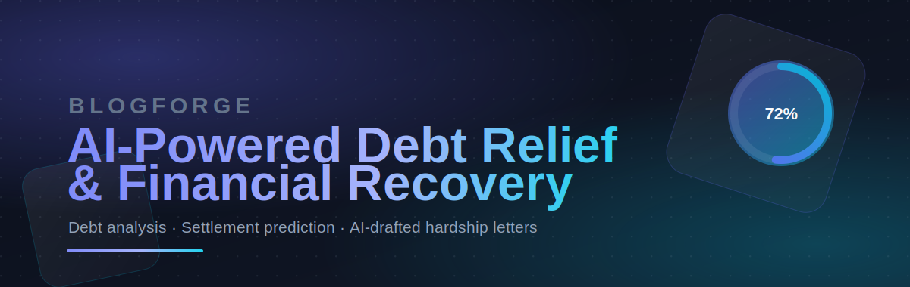
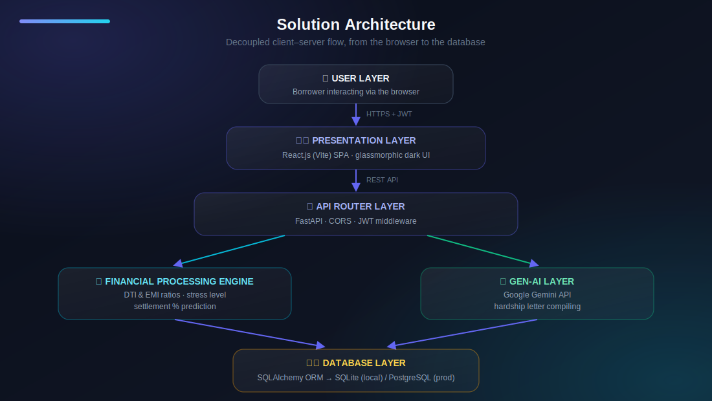

<div align="center">



<br/>

[](https://www.python.org/)
[](https://fastapi.tiangolo.com/)
[](https://react.dev/)
[](https://vitejs.dev/)
[](https://www.sqlalchemy.org/)
[](https://ai.google.dev/)
[](#-license)

<p><i>An intelligent, self-service platform that reads a borrower's financial life, predicts a realistic settlement, and drafts a professional negotiation letter — all in a few minutes.</i></p>

<sub>⭐ If this project helps you, consider starring the repo!</sub>

</div>

## 🔎 Overview

Borrowers who fall behind on loans or credit cards face severe financial anxiety, aggressive collection calls, and confusing legal language — with no clear idea what a *fair* settlement looks like or how to write a professional hardship letter to negotiate one.

**BlogForge** turns that struggle into a guided, five-step flow:

<div align="center">

`💬 Discovery`  →  `📝 Debt Input`  →  `📊 Stress Analysis`  →  `🤝 Settlement Prediction`  →  `✉️ AI Letter`

</div>

- 📊 Analyzes income, expenses, and every loan to calculate a **debt stress score**
- 🎯 Runs a **Settlement Predictor** for a realistic payoff percentage, based on delinquency, loan type, and stress level
- ✍️ Uses **Google Gemini AI** to draft a formal, print-ready **hardship negotiation letter**
- 🗂️ Keeps a full **audit history** of every prediction and letter ever generated

> 💡 Think of it as a financial co-pilot for negotiating your way out of debt — without an expensive settlement agency or lawyer.

<br/>

## ✨ Key Features

<table>
<tr>
<td width="50%" valign="top">

### 🔐 Secure Auth
JWT-based sessions with `bcrypt`-hashed passwords protect every account.

### 📈 Interactive Dashboard
Real-time totals for debt, income, expenses, and monthly surplus.

### 🧭 Visual Debt Distress Gauge
A custom animated SVG dial that shifts across *Low → Medium → High → Severe* as your DTI/EMI ratios change.

### 🤝 Adaptive Settlement Predictor
Suggests target settlements from **35%–85%**, factoring in delinquency length, secured vs. unsecured debt, and stress level.

</td>
<td width="50%" valign="top">

### 🗓️ Structured Payoff Plans
Breaks predictions into lump-sum vs. **3-month / 6-month** installment plans.

### 🤖 AI Negotiation Letters
Google Gemini drafts a formal hardship letter *and* a bulleted negotiation strategy in one click.

### 🛟 Offline Fallback Engine
No Gemini key? A high-fidelity local mock generator keeps every feature working.

### 📜 Audit History
An accordion log of every settlement prediction and letter you've ever generated.

</td>
</tr>
</table>

<br/>

## 🧱 Tech Stack

| Layer | Technology |
|:--|:--|
| **Frontend** |    — Vanilla CSS with an HSL design-token system, glassmorphism, and custom keyframe animations |
| **Backend** |   — async REST API with auto-generated Swagger docs |
| **Data** |   — portable to PostgreSQL (Neon / Supabase) in production |
| **Auth** | `passlib[bcrypt]` password hashing + `python-jose` JWT encoding/decoding |
| **Generative AI** |  for hardship letters & negotiation strategy |
| **Deployment** | `render.yaml` / `railway.json` (backend) · `vercel.json` (frontend SPA routing) |

<br/>

## 🏗️ Architecture

<div align="center">

</div>

<br/>

## 🗄️ Database Schema

<details>
<summary><b>Click to expand the 6-table relational schema</b></summary>

<br/>

| Table | Purpose |
|:--|:--|
| `users` | Core profile — name, email, hashed password, income & expenses |
| `financial_profile` | Calculated EMI ratio, DTI ratio, monthly surplus, stress level |
| `loans` | Each liability — lender, type, balance, APR, EMI, months overdue |
| `settlement_prediction` | Suggested settlement %, predicted payoff $, risk category |
| `ai_negotiation` | Generated negotiation strategy + full hardship letter text |
| `ai_history` | Audit trail of every prediction and letter generated |

```
users (1) ──── (1) financial_profile
  │
  └── (1:N) loans ──── (1:N) settlement_prediction
  │
  └── (1:N) ai_negotiation
  │
  └── (1:N) ai_history
```

</details>

<br/>

## 🗂️ Project Structure

<details>
<summary><b>Click to expand the full repository layout</b></summary>

```
AI-Powered-Debt-Relief-and-Financial-Recovery/
├── 1. Brainstorming & Ideation/        # Problem statement & empathy mapping
├── 2. Requirement Analysis/            # Tech stack, customer journey, DFDs
├── 3. Project Design Phase/            # Architecture & database schema
├── 4. Project Planning Phase/          # Milestones & sprint breakdown
├── 5. Project Development Phase/       # 🚀 Full source code
│   ├── backend/
│   │   ├── app/
│   │   │   ├── main.py                 # API routes
│   │   │   ├── models.py               # SQLAlchemy models
│   │   │   ├── schemas.py              # Pydantic schemas
│   │   │   ├── auth.py                 # JWT + bcrypt auth
│   │   │   ├── config.py / database.py
│   │   │   └── services/
│   │   │       ├── financial_engine.py # DTI/EMI/settlement math
│   │   │       └── gemini_service.py   # Gemini AI integration + fallback
│   │   ├── tests/                      # Pytest unit tests
│   │   ├── requirements.txt
│   │   └── run.py
│   └── frontend/
│       ├── src/
│       │   ├── context/AuthContext.jsx
│       │   ├── pages/
│       │   │   ├── Login.jsx / Register.jsx
│       │   │   ├── Dashboard.jsx
│       │   │   ├── SettlementPredictor.jsx
│       │   │   ├── LetterGenerator.jsx
│       │   │   └── History.jsx
│       │   └── index.css               # Design tokens & animations
│       └── package.json
├── 6. Project Testing/                 # Test plans & pytest results
├── 7. Project Documentation/           # User manual & setup guide
├── 8. Project Demonstration/           # Demo script & future roadmap
├── render.yaml                         # Render deployment config
└── railway.json                        # Railway deployment config
```

</details>

<br/>

## 🚀 Getting Started

### Prerequisites

  

A **Google Gemini API key** is optional but recommended → [get one free from Google AI Studio](https://aistudio.google.com/app/apikey). Without it, the app automatically uses its local mock letter generator.

### 1️⃣ Clone the Repository

```bash
git clone https://github.com/kancharlamounika18/AI-Powered-Debt-Relief-and-Financial-Recovery.git
cd AI-Powered-Debt-Relief-and-Financial-Recovery
```

### 2️⃣ Backend Setup

```bash
cd "5. Project Development Phase/backend"

# Create & activate a virtual environment
python -m venv venv
source venv/bin/activate       # macOS/Linux
# venv\Scripts\Activate.ps1    # Windows PowerShell

# Install dependencies
pip install -r requirements.txt
```

Create a `.env` file inside `backend/`:

```env
GEMINI_API_KEY=your_actual_gemini_api_key_here
```

Run the API:

```bash
python run.py
```

> 🌐 The backend boots at **http://127.0.0.1:8000** — interactive Swagger docs live at **http://127.0.0.1:8000/docs**

### 3️⃣ Frontend Setup

```bash
cd "../frontend"
npm install
```

Create a `.env` file inside `frontend/`:

```env
VITE_API_URL=http://127.0.0.1:8000
```

Run the dev server:

```bash
npm run dev
```

> 🌐 The app is now live at **http://localhost:5173**

<br/>

## 🧭 User Guide

| Step | Action |
|:--:|:--|
| 1 | **Create an account**, then set your **Monthly Income** and **Basic Expenses** in Profile Settings |
| 2 | **Add loan accounts** — lender, type, balance, APR, EMI, months overdue. Watch the **Debt Distress Gauge** update live |
| 3 | Open the **Settlement Predictor** to get a suggested settlement %, payoff amount, risk category, and payment plan |
| 4 | Open the **AI Letter Generator** — pick a creditor + hardship reason, click **Generate**, then copy or download the letter |
| 5 | Revisit everything anytime from **History & Logs** |

<br/>

## 🧪 Testing

Automated backend tests validate the financial engine's math boundaries (low vs. severe stress, secured vs. unsecured settlement markups):

```bash
cd "5. Project Development Phase/backend"
python -m pytest tests
```

```
collected 4 items
tests/test_financial_engine.py ....                                 [100%]
======================== 4 passed in 1.05s ========================
```

Frontend production build check:

```bash
cd "5. Project Development Phase/frontend"
npm run build
```

<br/>

## 🗺️ Roadmap

- [ ] 🔗 **Plaid API** — real-time bank account & transaction syncing
- [ ] 📊 **Credit bureau integration** (Experian / TransUnion / Equifax) for automatic profile import
- [ ] 📮 **Lob API** — one-click certified mail delivery of hardship letters
- [ ] 💬 **Interactive settlement chatbot** trained on debt negotiation & collections regulations

<br/>

## 📄 License

Licensed under the **MIT License** — free to use, modify, and build on.

<br/>

<div align="center">

Built with ❤️ to make debt relief a little less overwhelming.

</div>